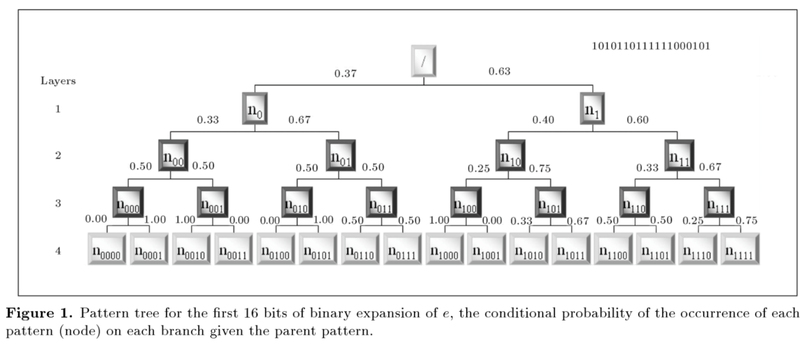

# Cryptographically Strong Pseudo Random Number Generation using Generative Adversarial Networks
This project seeks to assess the viability of generative adversarial networks
(GANs) for the implementation of a cryptographically secure pseudo random
number generator (CSPRNG). It draws inspiration from recent work on
bootstrapping encryption schemes using GANs. [Learning to Protect Communications
with Adversarial Neural Cryptography](https://arxiv.org/abs/1610.06918).


## 1 - Neural Networks
This section will outline the basic theoretical background of neural networks.


## 2 - Generative Models
This section will provide some background on generative models in general,
making reference to [NIPS 2016 Tutorial: Generative Adversarial Networks](https://arxiv.org/abs/1701.00160).


## 3 - Generative Adversarial Networks
The basic idea of GANs is to set up a game between two players. One of them
is called the **generator**. The generator creates samples that are intended
to come from the same distribution as the training data. The other player is
a **discriminator**. The discriminator examines samples to determine whether
they are real or fake. The discriminator learns using traditional supervised learning techniques, dividing inputs into two classes.

Formally, GANs are a structured probabilistic model containing latent
variables *z* and observed variables *x*.

The two players in the game are presented by two functions, each of which is
differentiable both with respect to its inputs and with respect to its
parameters. The discriminator is a function *D* that takes *x* as input and
uses *\theta^D* as parameters. The generator is defined by a function *G* that
takes *z* as input and uses


## 4 - Cryptographically Secure Pseudo Random Number Generators
A PRNG is a cryptographic algorithm used to generate numbers that must appear
random. A PRNG has a secret state, *S*. Upon request, it must generate outputs
that are indistinguishable from random numbers to an attacker who doesn't know
and cannot guess *S*. Additionally, a PRNG must be able to alter its secret
state by processing input values that may be unpredictable to an attacker. These
are values typically collected from physical processes with sufficient entropy.

Note that in principle, any method of distinguishing between PRNG outputs and
random outputs is an attack; in practice, we care much more about the ability
to learn the values of PRNG outputs not seen by the attacker, and to predict
or control future outputs.


### Applications of Random Number Generators
Many aspects of cryptography require random numbers, including key generation,
nonces, one-time pads, and salts in certain signature schemes.

### Security Requirements of CSPRNGs
This section draws on this Wikipedia [page](https://en.wikipedia.org/wiki/Cryptographically_secure_pseudorandom_number_generator#Requirements).

CSPRNG requirements fall into two groups: first, that they pass statistical
randomness tests; and secondly, that they hold up well under serious attack,
even when part of their initial or running state becomes available to an
attacker.

1.  Every CSPRNG should satisfy the **next-bit test**. That is, given the first
    k bits of a random sequence, there is no polynomial-time algorithm that can
    predict the (k+1)th bit with probability of success non-negligibly better
    than 50%. Andrew Yao proved in 1982 that **a generator passing the next-bit
    test will pass all other polynomial-time statistical tests for randomness.**
2.  Every CSPRNG should withstand "**state compromise extensions**". In the event
    that part or all of its state has been revealed (or guessed correctly),
    it should be impossible to reconstruct the stream of random numbers prior
    to the revelation. Additionally, if there is an entropy input while running,
    it should be infeasible to use knowledge of the input's state to predict
    future conditions of the CSPRNG state.

Example: If the CSPRNG under consideration produces output by computing bits
of π in sequence, starting from some unknown point in the binary expansion,
it may well satisfy the next-bit test and thus be statistically random,
as π appears to be a random sequence. However, this algorithm is not
cryptographically secure; an attacker who determines which bit of pi
(i.e. the state of the algorithm) is currently in use will be able to calculate
all preceding bits as well.

### Random Number Generator Attacks
This section draws on this Wikipedia [page](https://en.wikipedia.org/wiki/Random_number_generator_attack).

Lack of quality in a PRNG generally provides attack vulnerabilities and so
leads to lack of security, even to **complete compromise**, in cryptographic
systems. The RNG process is particularly attractive to attackers because it is
typically a **single isolated hardware or software component** easy to locate.

For **software RNGs**, which this work is concerned with, we can identify these
major types of attacks:

1.  **Direct cryptanalytic attacks**: when an attacker obtains part of the stream
    of random bits and uses this to distinguish the RNG output from a truly
    random stream (i.e. to predict future bits).
2.  **Input-based attacks**: when an attacker manages to modify the input to the
    RNG to attack it, for example by "flushing" existing entropy and putting
    the RNG in a known state.
3.  **State compromise extension attacks**: when the internal secret state of the
    RNG is known at some time, it can be used to predict future output or to
    recover previous output. This can happen when a generator starts up and has
    little or no entropy, so the attacker may be able to guess the initial
    state.

This work is mostly concerned with cryptanalytic attacks.


## 5 - Testing CSPRNGs
Several standard statistical tests exist for the randomness of a random number
sequence. These include the **chi-squared test**, the **Kolmogorov-Smirnov
test**, **Spearman's Rank Correlation Coefficient test**, the **Runs test**,
and the **Spectral test**. Simpler, "empirical" tests are also used,
such as the **equidistribution test**, the **serial test**, and the **gap
test**.

As mentioned above, Yao showed that passing the next-bit test is equivalent to 
passing all other polynomial-time statistical tests for randomness. However, 
using the universal quantifier (every algorithm) confines the next bit test 
to being merely theoretical, rather than a practical test.

This work relies on a paper by Lavasani and Eghlidos, in which a **Practical
Next Bit Test** is developed on the base of the **Sadeghiyan-Mohajeri test**.
This section summarizes both tests, and how the former is derived from the
latter.

### Sadeghiyan-Mohajeri Test
Sadeghiyan and Mohajeri presented a test that measures the randomness of a
sequence based on the predictability of the next bit of an underlying sequence,
given the former bits.

The test algorithm takes advantage of a tree structure, which stores information
on the patterns of subsequences in the overall sequence.



In the pattern tree, each node in depth `l` represents the number of
occurrences of a binary pattern of length `l` in the underlying sequence.
Each edge connecting two nodes denotes the ratio of the number of child patterns
located in the next later to the number of their parent patterns in the previous
layer that is, a conditional probability `P(child | parent)`. For a large enough
random sequence, it is expected that all the ratios corresponding to the edges
of the pattern tree to be approximately equal to 1/2.

The algorithm for the test is as follows (in Python-style pseudo-code):

```python
# todo code goes here
```
The test does not prescribe any specific criteria for global judgement about
the randomness of a sequence.

### Extended Next-Bit Test
Lavasani and Eghlidos provide a formal definition of an *Extended Next Bit
Test*, and a proof of its equivalence to the Next Bit Test.


## 6 - Implementation Architecture
At a high level, the system consists of two adversarially trained neural
networks: a **generator**, hereby referred to as Jerry, and a **discriminator**,
hereby referred to as Eve.

### Architecture of Generator (Jerry)

### Architecture of Discriminator (Eve)


## 7 - Testing Methodology
This section will outline how the implementation is tested.


## 8 - Evaluation
This section will outline the results of training.
